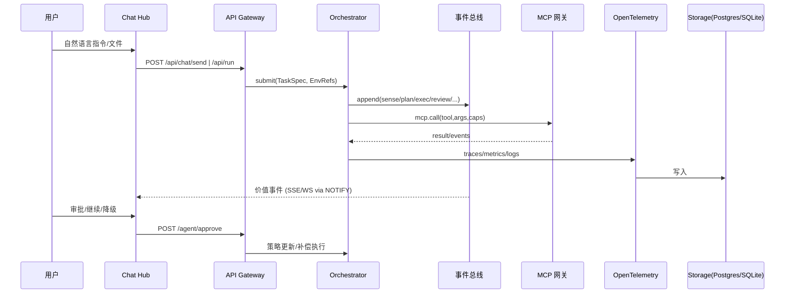

# AOS v0.1｜MCP 优先总体方案

> 目标：在现有 Next.js + Express + LangGraph + OpenTelemetry + Postgres 基座之上，落地 MCP over HTTPS 的统一接入能力与价值事件驱动的操作中枢。

## 0. TL;DR（关键决策）
- **首页 = 会话中枢（Chat Hub）**：只呈现对用户决策有价值的系统事件；原始日志留在监控/项目视图。
- **导航命名**：`Chat Hub / Monitor / Projects / Memory / Settings / Integrations / Agents`，其中 Integrations 负责 MCP/API/UI 服务注册与网关；Settings 专注系统级参数。
- **配置分层**：系统设置（LLM、OTel、数据库、MCP 网关）与运行时环境（Secrets & Env）解耦，运行时密钥仅在执行期注入，最小权限 + 审计。
- **消息总线演进**：M0 使用 Postgres outbox + `LISTEN/NOTIFY`，M1 升级 NATS/Redis Streams，M2 引入 ClickHouse 做 OLAP。

## 1. 前端信息架构（IA）
```mermaid
flowchart TB
  Home[首页 · Chat Hub]:::p --> Mon[监控]
  Home --> Proj[项目管理]
  Home --> Mem[记忆管理]
  Home --> Cfg[设置]
  Home --> Hub[集成与网关（Integrations）]
  Home --> Agm[智能体管理（Agents）]

  subgraph Chat Hub
    CH1[对话区：用户↔助手]
    CH2[工作区：文件/产物预览]
    CH3[价值消息流：进度/异常/审批/回执]
  end

  subgraph 监控
    M1[系统指标：CPU/吞吐/延迟]
    M2[日志检索：筛选/上下钻]
    M3[Trace：瀑布图/拓扑]
  end

  subgraph 项目管理
    P1[任务列表：进行中/排队/已完成]
    P2[实时运行：日志/帧/工件]
    P3[SOP 蓝图：可视编辑/版本化]
    P4[任务回放：Replay + 重跑]
  end

  subgraph 记忆管理
    R1[用户画像/偏好]
    R2[项目蓝图/变量库]
    R3[记忆编辑：增删改查 + 审计]
  end

  subgraph 设置
    S1[系统配置：LLM/OTel/DB]
    S2[权限：角色/资源粒度]
    S3[安全：IP 白名单/脱敏]
  end

  subgraph 集成与网关
    G1[MCP Registry：服务清单]
    G2[路由转发：MCP over HTTPS]
    G3[健康与配额：限流/熔断]
  end

  subgraph 智能体管理（Agents）
    A1[Agent 列表：本地/远程]
    A2[生命周期：启动/停止/伸缩]
    A3[配置：Prompt/SOP/工具映射/环境变量]
    A4[版本与模板：克隆/发布/回滚]
    A5[健康与日志：实时/回放]
  end

classDef p fill:#eef,stroke:#88f
```

**价值消息准入规则**：`task.acceptance`、`task.progress.milestone`、`task.receipt`、`approval.request`、`anomaly.detected`、`recovery.start|done`。每条消息生成摘要卡片，挂载操作入口与 trace 链接。

## 2. 总体技术架构（以 MCP 网关为核心）
```mermaid
flowchart LR
  subgraph UI[Next.js 15 前端]
    UI1[Chat Hub]
    UI2[监控 & Trace]
    UI3[项目 & 回放]
    UI4[记忆/配置/集成]
    UI5[智能体管理]
  end

  UI -->|REST/WebSocket| API[Express API Gateway]
  API -->|MCP over HTTPS| MCPGW[MCP 网关/聚合器]
  API -->|LangGraph| ORCH[Orchestrator\n(Planner/Executor/Critic/Reviser)]
  API -->|OpenAPI| ADMIN[Admin APIs\n(/config,/auth,/jobs)]

  subgraph Tools[工具域（MCP & API）]
    ENV[Env-MCP\n(files/git/http/db/shell)]
    EXT[第三方 MCP/API\n(e.g. SaaS, 向量库)]
    INT[内部脚本/技能\n(csv.clean/viz.plot)]
  end

  MCPGW <-->|cap/token| ENV
  MCPGW <-->|cap/token| EXT
  ORCH -->|调用/回放| INT

  subgraph Telemetry[可观测]
    OTel[OpenTelemetry SDK]
    COL[OTel Collector]
  end
  ORCH --> OTel
  API --> OTel
  MCPGW --> OTel
  OTel --> COL

  subgraph Storage[存储]
    SQLITE[(SQLite Outbox：M0)]
    PG[(Postgres/pgvector：M1)]
    CK[(ClickHouse：M2)]
  end

  ORCH <-->|Outbox| SQLITE
  COL --> SQLITE
  SQLITE --> PG
  PG --> CK

  subgraph Bus[消息总线]
    BUS0[(Outbox.sqlite)]
    BUS1[(NATS/Redis Streams v1)]
  end

  ORCH <--> BUS0
  ORCH <--> BUS1
```

## 3. 事件与数据流


## 4. 配置与权限模型
- **系统设置（Settings）**：LLM Provider & 模型参数、OTel Exporter、数据库选择（SQLite/PG）、MCP 网关注册表、安全策略（IP 白名单、脱敏规则）。
- **运行时环境（Secrets & Env）**：项目/任务级作用域，仅执行期解密；界面只显示名称与用途；增删需审计与可选双人确认。
- **角色建议**：Owner / Admin / Operator / Viewer。资源粒度：项目、任务、Agent、工具。
- **交互模式**：配置编辑采用 Modal + 差异预览；保存动作自动写入 `audit_logs`。

## 5. 接口草案（REST & MCP）

### Chat & 任务流
| 方法 | 路径 | 说明 |
| --- | --- | --- |
| POST | `/api/chat/send` | 投递对话与 Action DSL，返回 `trace_id` 与初始事件 |
| POST | `/api/run` | 提交任务（TaskSpec + Env 引用），写入 `jobs` 并触发执行 |
| GET | `/api/episodes/:traceId` | 聚合 run 结果用于回放/分析 |
| WS/SSE | `/agent/events` | 只推送价值事件（白名单主题） |
| POST | `/agent/approve` | 审批继续/降级/中止等操作 |

### Integrations（MCP 网关）
| 方法 | 路径 | 说明 |
| --- | --- | --- |
| GET | `/mcp/registry` | 列出已注册服务（name/url/caps/健康度/配额） |
| POST | `/mcp/call` | 代理调用指定 MCP server 的工具（传入 server/tool/args/caps） |
| POST | `/mcp/registry` | （M1）注册/更新服务，支持配额与限流 |

### Agents 管理
| 方法 | 路径 | 说明 |
| --- | --- | --- |
| GET | `/agents` | Agent 列表（状态、版本、负载、最近错误） |
| POST | `/agents` | 新建 Agent（模板/镜像 + 配置） |
| GET | `/agents/:id` | Agent 详情（配置、运行统计、关联项目） |
| PATCH | `/agents/:id` | 更新 Prompt/SOP/工具映射/并发等 |
| POST | `/agents/:id/start` | 启动 Agent |
| POST | `/agents/:id/stop` | 停止 Agent |
| POST | `/agents/:id/release` | 发布/回滚版本 |
| GET | `/agents/:id/logs?tail=1` | SSE/WS 实时日志 |
| POST | `/agents/:id/register-mcp` | 将 Agent 注册到 MCP 网关（生成路由前缀） |

### 系统设置 & 权限
| 方法 | 路径 | 说明 |
| --- | --- | --- |
| GET/PUT | `/config/system` | 系统级配置（LLM/OTel/DB/MCP 注册表） |
| GET/PUT | `/config/runtime` | Secrets & Env 模板（仅引用名） |
| GET/POST | `/rbac/roles` | 角色定义与权限粒度配置 |
| GET | `/audit/logs` | 审计视图（可分页、过滤） |

## 6. 数据模型（Postgres M0 必备）
```sql
CREATE TABLE events (
  id            BIGSERIAL PRIMARY KEY,
  trace_id      TEXT,
  topic         TEXT,
  type          TEXT NOT NULL,
  severity      TEXT,
  payload       JSONB NOT NULL,
  created_at    TIMESTAMPTZ DEFAULT now()
);

CREATE TABLE jobs (
  id            BIGSERIAL PRIMARY KEY,
  trace_id      TEXT UNIQUE,
  spec          JSONB NOT NULL,
  status        TEXT,
  priority      INT DEFAULT 0,
  scheduled_at  TIMESTAMPTZ,
  started_at    TIMESTAMPTZ,
  finished_at   TIMESTAMPTZ,
  error         JSONB
);

CREATE TABLE traces (
  trace_id      TEXT PRIMARY KEY,
  status        TEXT,
  cost_cny      NUMERIC,
  latency_ms    INT,
  started_at    TIMESTAMPTZ,
  finished_at   TIMESTAMPTZ
);

CREATE TABLE agents (
  id            BIGSERIAL PRIMARY KEY,
  name          TEXT UNIQUE NOT NULL,
  type          TEXT CHECK (type IN ('local','remote')),
  version       TEXT,
  route_prefix  TEXT,
  replicas      INT DEFAULT 1,
  status        TEXT,
  config        JSONB,
  caps          JSONB,
  created_at    TIMESTAMPTZ DEFAULT now()
);

CREATE TABLE agent_runs (
  run_id        BIGSERIAL PRIMARY KEY,
  agent_id      BIGINT REFERENCES agents(id),
  trace_id      TEXT,
  status        TEXT,
  stats         JSONB,
  started_at    TIMESTAMPTZ,
  finished_at   TIMESTAMPTZ
);

CREATE TABLE mem_embeddings (
  id            BIGSERIAL PRIMARY KEY,
  subject       TEXT,
  project_id    TEXT,
  embedding     VECTOR(1536),
  meta          JSONB,
  updated_at    TIMESTAMPTZ DEFAULT now()
);

CREATE TABLE project_vars (
  id            BIGSERIAL PRIMARY KEY,
  project_id    TEXT,
  name          TEXT,
  scope         TEXT,
  usage         TEXT,
  secret_ref    TEXT,
  last_rotated  TIMESTAMPTZ,
  audit_ref     TEXT
);

CREATE TABLE audit_logs (
  id            BIGSERIAL PRIMARY KEY,
  actor         TEXT,
  action        TEXT,
  resource      TEXT,
  diff          JSONB,
  created_at    TIMESTAMPTZ DEFAULT now()
);

CREATE TABLE mcp_registry (
  name         TEXT PRIMARY KEY,
  base_url     TEXT NOT NULL,
  description  TEXT,
  capabilities JSONB NOT NULL,
  auth_token   TEXT,
  timeout_ms   INTEGER,
  created_at   TIMESTAMPTZ DEFAULT now(),
  updated_at   TIMESTAMPTZ DEFAULT now()
);

CREATE TABLE sandbox_scripts (
  id           UUID PRIMARY KEY,
  name         TEXT NOT NULL,
  entry_file   TEXT NOT NULL,
  description  TEXT,
  schedule_ms  BIGINT,
  env          JSONB,
  created_at   TIMESTAMPTZ DEFAULT now(),
  updated_at   TIMESTAMPTZ DEFAULT now()
);
```

## 7. 里程碑与落地（M0 → M2）
- **M0（本周）**：
  - Postgres + `vector`（可选 `pgmq`）初始化；Outbox + `LISTEN/NOTIFY` 完成价值事件推送。
  - Chat Hub 接入 SSE/WS，价值事件卡片上线；项目任务列表 + 回放。
  - Integrations 提供 MCP registry 只读列表与 `/mcp/call` 转发。
  - Agents 最小闭环：新建/启动/停止/查看日志/注册 MCP。
  - 设置区分系统设置与运行时环境，审计表写入。
- **M1（下周）**：
  - 记忆管理全量（向量检索、标签）；MCP 网关限流/熔断；审批流完善。
  - Agents 模板/版本管理、伸缩策略；Analyzer 消费 `anomaly.* / task.receipt` 生成修复建议。
- **M2（后续）**：
  - ClickHouse OLAP；自动化日志分析与策略工厂；多实例调度与金丝雀发布；跨项目配额与成本账本。

## 8. 风险与应对
- **PG 扩展不可用**：保持 Outbox 抽象，随时替换为 NATS/Redis。`LISTEN/NOTIFY` + 轮询兜底。
- **MCP 服务不稳定**：网关层加重试/熔断/隔离策略；在事件模型写入 tool 名称与错误指纹，便于告警。
- **前端实时压力**：价值事件流做去抖（1s 聚合窗口）并保留“查看更多”分页；本地缓存与懒加载 Trace 详情。
- **Secrets 泄露风险**：统一密钥托管，界面不展示明文；强制审计 + 可选多因子确认。

## 9. 演示脚本（M0 验收）
1. 在 Agents 新建本地 Agent → 绑定工具 → 启动并注册到 MCP 网关。
2. 在 Chat Hub 发起任务 → 即时看到进度/异常/审批卡片 → 结束展示回执与产物列表。
3. 打开监控页 → 查看对应 trace 的耗时与日志 → 在 Projects 页面回放并重跑一次任务。

---

本蓝图覆盖前端路由、后端 API、MCP 网关、事件总线与数据模型，作为 AOS v0.1 的执行指南，可在后续迭代中继续细化接口协议与实现细节。
