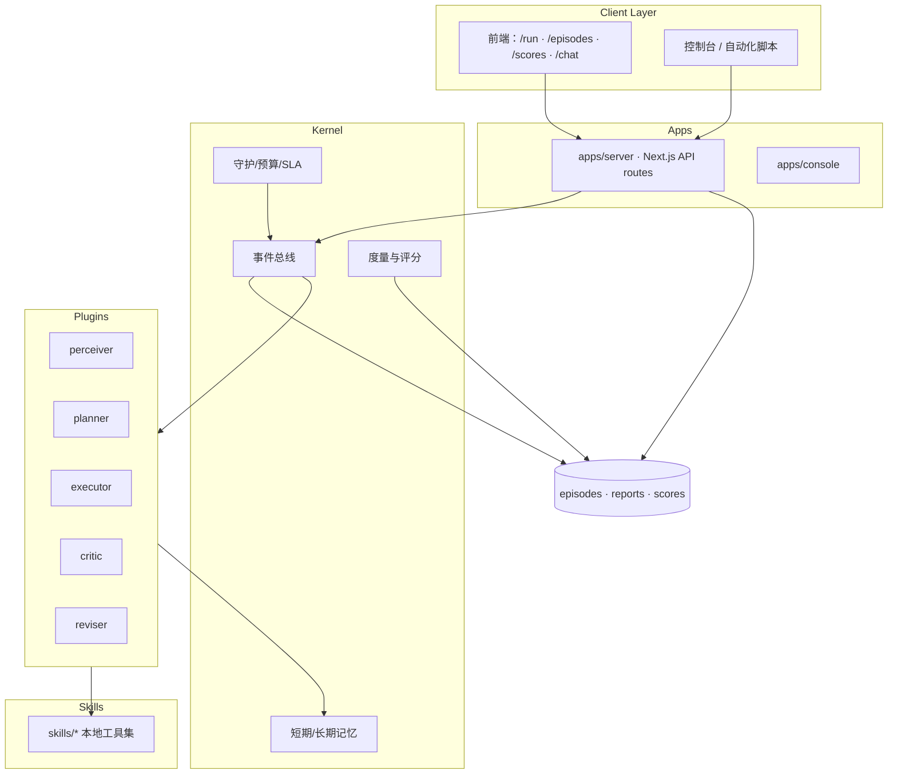
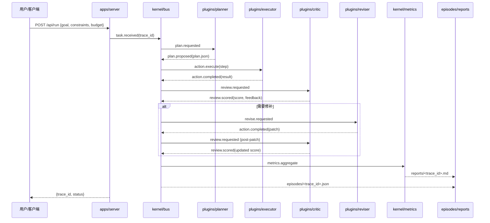

# AOS 详细设计与 API 契约

最后更新：2024-04-05（请在重大架构变更后同步修订）。

## 1. 文档目的与范围

本文件面向 AOS 项目的产品负责人、技术负责人与贡献者，说明系统的总体架构、模块职责、关键数据结构、运行流程以及对外 API 契约。内容覆盖最小可用版本（MVP）并预留扩展位，以便在后续演进时作为基线对照。

## 2. 系统整体视图

AOS 旨在为单体或多体 Agent 提供一套可回放、可评估的操作系统抽象，核心由「微内核 + 插件」组成：



### 2.1 核心原则

1. **Plan-Execute-Review 闭环**：所有任务都需经过规划、执行、评审、修补、稳定化七个阶段，并记录在事件流中。
2. **事件驱动**：内核通过事件总线调度插件，各插件互相解耦，通过订阅/发布机制协作。
3. **可回放与度量**：每次运行生成 `episodes/<trace_id>.json` 与 `reports/*`，可通过 `pnpm replay` 复现并统计 `score`。
4. **插件可插拔**：Planner/Executor 等遵循统一接口（`packages/agents` 中定义的契约），便于替换不同模型或策略。

## 3. 模块职责与交互

| 模块 | 主要职责 | 输入 | 输出 | 依赖 |
| --- | --- | --- | --- | --- |
| `apps/server` | 提供 REST/Webhook/API Route，负责鉴权、请求校验与事件触发。 | HTTP 请求、Webhooks | 内核事件、HTTP 响应 | `kernel/*`, `packages/*` |
| `apps/console` | Web UI（Next.js），展示任务状态、Episodes 列表、评分与配置界面。 | API 数据、用户交互 | UI 渲染、控制命令 | `apps/server` APIs |
| `kernel/bus` | 事件路由、生命周期管理、持久化。 | API/插件事件 | 调度指令、`episodes` | `kernel/memory`, `kernel/metrics` |
| `kernel/guardian` | 预算/SLA 守护，防止越权或成本超标。 | 计划、执行日志 | 授权/拒绝事件 | `packages/schemas` |
| `kernel/memory` | 任务上下文、长期记忆与缓存。 | 事件、状态 | 状态快照 | 存储后端（文件/DB） |
| `kernel/metrics` | 评分、统计、回放验证。 | Episodes、报告 | `reports/*`, `scores.csv` | `tests/`, `scripts/*` |
| `plugins/perceiver` | 将外部输入解析为内部任务描述（goal、约束、上下文）。 | 用户输入、历史数据 | 规范化 `Task` | `packages/prompts`, `skills/*` |
| `plugins/planner` | 生成 `plan.json`（多步计划），遵循 Schema。 | `Task`, 约束 | `Plan` 事件 | LLM/规则引擎 |
| `plugins/executor` | 调用工具/模型执行计划中的步骤。 | `Plan`、技能能力图 | `Action` 事件 | `skills/*`, 外部 API |
| `plugins/critic` | 评估执行结果，给出通过/修复建议。 | `Action` 结果 | `Review` 事件 | LLM/规则 |
| `plugins/reviser` | Patch-Once 能力，针对 critic 输出进行修复。 | `Review` 结果、上下文 | 修复后的 `Action` | LLM/技能 |
| `skills/*` | 本地可复用工具，降低对外部 LLM 的依赖。 | 输入参数 | 输出结果 | Node.js/Python 运行时 |
| `tests/*` | 自动化验证，覆盖契约与回放。 | 系统工件 | 报告 | `pnpm test`, `pnpm smoke` |

## 4. 关键数据结构

- **Task**：`{ goal: string, constraints: string[], context?: Record<string, any> }`
- **Plan (`plan.json`)**：符合 `AGENTS.md` 中定义的 Schema，包含预算、接受条件、步骤与风险。
- **Event**：`{ id, type, payload, timestamp, trace_id }`，存于 episodes；类型包括 `task.received`, `plan.proposed`, `action.started`, `review.scored` 等。
- **Report**：Markdown/HTML，总结执行过程、评分与后续建议。

## 5. API 契约

API 通过 `apps/server` 暴露，默认挂载在 `/api` 前缀下。所有响应遵循 `{ code: string; message: string; data?: any; trace_id?: string }` 结构，当出现错误时返回 `4xx/5xx` 并附带 `trace_id`。

### 5.1 健康检查

| 方法 | 路径 | 描述 |
| --- | --- | --- |
| `GET` | `/api/health` | 返回服务健康状态与版本信息。 |

**响应示例**

```json
{
  "code": "OK",
  "message": "healthy",
  "data": {
    "version": "0.1.0",
    "uptime": 123.45
  }
}
```

### 5.2 触发任务运行

| 方法 | 路径 | 描述 |
| --- | --- | --- |
| `POST` | `/api/run` | 接收用户任务，触发 Plan→Execute→Review 流程，返回 `trace_id`。 |

**请求体**

```json
{
  "goal": "string",
  "constraints": ["string"],
  "context": {
    "source": "chat|console|api",
    "metadata": {}
  },
  "budget": {
    "currency": "CNY",
    "limit": 1.0
  }
}
```

**成功响应**

```json
{
  "code": "ACCEPTED",
  "message": "task scheduled",
  "data": {
    "trace_id": "20240401-abcdef",
    "status": "pending"
  }
}
```

### 5.3 查询 Episodes 列表

| 方法 | 路径 | 描述 |
| --- | --- | --- |
| `GET` | `/api/episodes` | 返回最近运行的 episodes 元数据列表，可分页。 |

**响应示例**

```json
{
  "code": "OK",
  "message": "success",
  "data": {
    "items": [
      {
        "trace_id": "20240401-abcdef",
        "goal": "string",
        "started_at": "2024-04-01T12:00:00Z",
        "status": "completed",
        "score": 0.92
      }
    ],
    "pagination": {
      "page": 1,
      "page_size": 20,
      "total": 1
    }
  }
}
```

### 5.4 获取单个 Episode 详情

| 方法 | 路径 | 描述 |
| --- | --- | --- |
| `GET` | `/api/episodes/{trace_id}` | 返回指定运行的完整事件数组。 |

**响应示例**

```json
{
  "code": "OK",
  "message": "success",
  "data": {
    "trace_id": "20240401-abcdef",
    "events": [
      {
        "id": "evt-001",
        "type": "task.received",
        "timestamp": "2024-04-01T12:00:00Z",
        "payload": {
          "goal": "..."
        }
      }
    ],
    "reports": [
      {
        "path": "reports/20240401-abcdef.md",
        "score": 0.92
      }
    ]
  }
}
```

### 5.5 回放指定 Episode

| 方法 | 路径 | 描述 |
| --- | --- | --- |
| `POST` | `/api/episodes/{trace_id}/replay` | 触发离线回放，验证事件重放一致性，并返回评分变化。 |

**请求体（可选）**

```json
{
  "mode": "deterministic",
  "temperature": 0,
  "seed": 42
}
```

**成功响应**

```json
{
  "code": "OK",
  "message": "replay completed",
  "data": {
    "trace_id": "20240401-abcdef",
    "score_before": 0.92,
    "score_after": 0.94,
    "diff": 0.02
  }
}
```

## 6. 运行流程（时序）

以下流程展示从用户提交任务到生成报告、可回放的关键步骤：



## 7. 配置与运行约束

- **运行环境**：Node.js ≥ 20，包管理器使用 `pnpm`。
- **核心命令**：`pnpm setup`、`pnpm dev`、`pnpm typecheck`、`pnpm lint`、`pnpm test`、`pnpm smoke`、`pnpm replay`、`pnpm score`。
- **配置文件**：
  - `plan.json`：每次执行前的计划；需符合 Schema，便于 Guardian 审批。
  - `.env.local`：本地敏感信息；禁止提交到仓库。
- **安全/守护**：Guardian 监控成本、延迟与权限。如触发阈值，流程会中止并写入事件。

## 8. 非功能需求与指标

| 指标 | 目标 | 说明 |
| --- | --- | --- |
| 成功率 | ≥ 0.8 | `review.scored` 事件中得分达到 0.8 以上视为通过。 |
| 回放一致性 | 100% | `pnpm replay` 结果与原始运行差异 ≤ 1e-6（浮点误差范围内）。 |
| 成本控制 | Guardian 预算不超限 | 默认预算 1 CNY，可在 `budget.limit` 内调节。 |
| 可观测性 | Episodes/Reports 完整 | 每次运行必须产生对应文件并可供下载。 |

## 9. 开放问题与后续工作

- 确定 `skills/*` 的运行沙箱（Node vs. Python）。
- 细化 API 鉴权方案（API Key / OAuth）。
- 扩展多 Agent 协作模式下的事件模型。
- 补充 `tests/` 与 `scripts/replay.mjs` 的详细实现文档。

---

如对本文档内容有疑问或建议，请在 `docs/README.md` 中登记并通知项目维护者。重大变更需要 Tech Lead 审核并更新对应章节。
